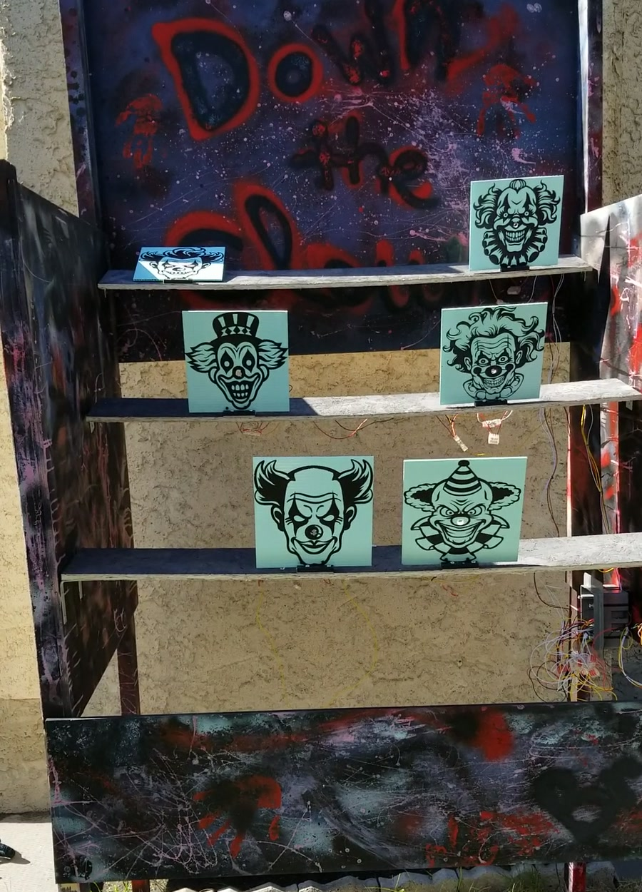
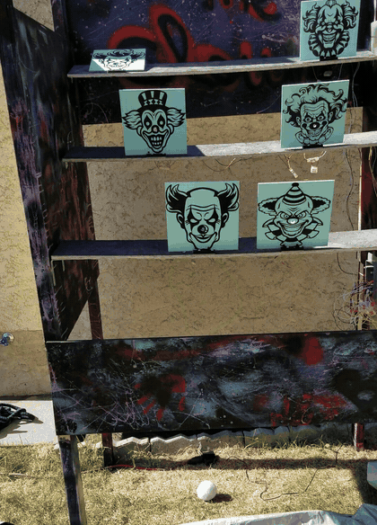
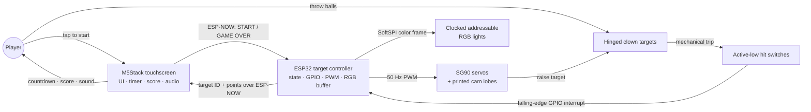
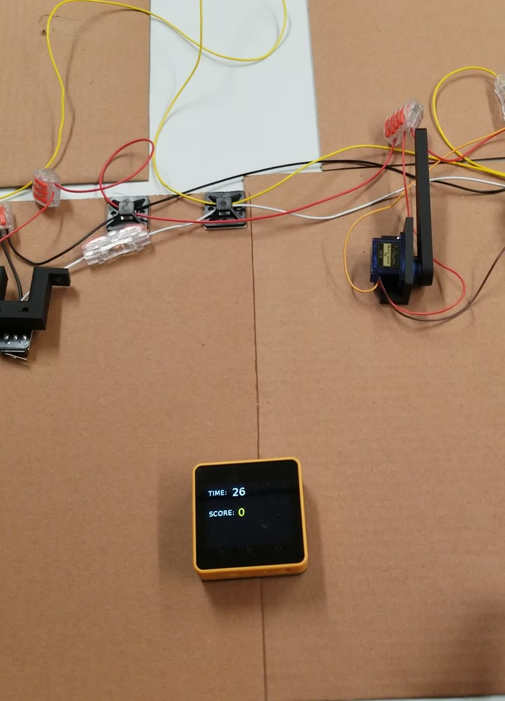
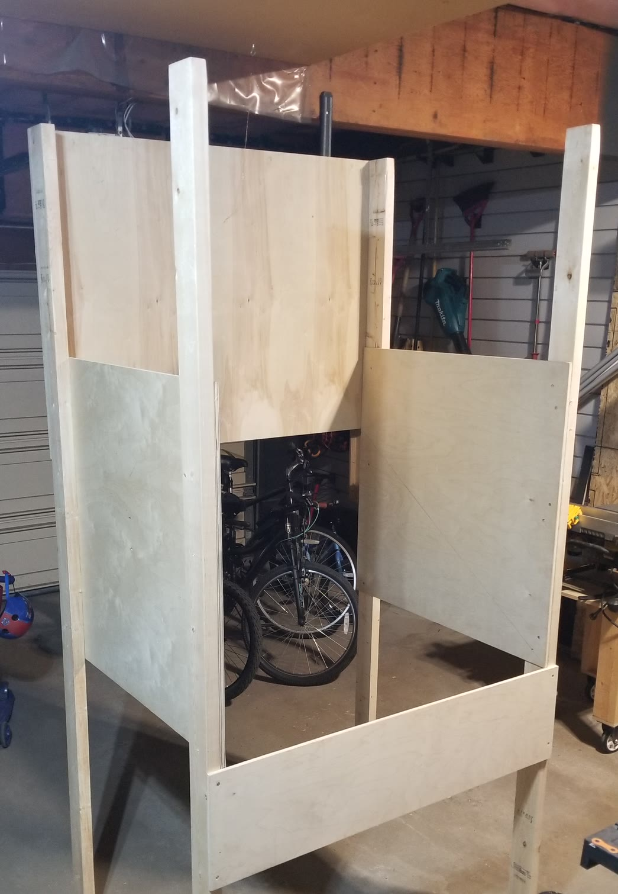

# Down the Clown

> A custom electromechanical arcade game designed and built from scratch as a gift—from embedded firmware and electronics to parametric CAD, 3D-printed mechanisms, and a full wooden cabinet.

<p align="center">
  <a href="docs/media/down-the-clown-gameplay.mp4">
    
  </a>
</p>
<p align="center"><em>Completed integrated build during a live play session. Select the image to watch the full demonstration.</em></p>

Down the Clown turns a carnival ball toss into a 30-second embedded game. A player taps the M5Stack touchscreen to start, then throws balls at color-coded hinged clown targets. Each hit is detected by an ESP32, scored according to the target's current difficulty, acknowledged with sound and an updated display, and followed by an automatic servo-driven reset.

This project is an end-to-end build: interaction design, game logic, wireless communication, sensor and actuator integration, parametric mechanical design, fabrication, cabinet construction, system debugging, and delivery of a finished physical product.

## Engineering scope

| Area | Work delivered |
| --- | --- |
| Embedded systems | Wrote MicroPython firmware for an ESP32 target controller and an M5Stack touchscreen interface |
| Electronics | Integrated active-low hit switches, PWM-controlled servos, clocked addressable RGB lights, and embedded audio |
| Communication | Split real-time responsibilities across two controllers using routerless ESP-NOW broadcasts |
| Mechanical design | Created parametric servo cams, brackets, switch mounts, hinge stops, and a cabinet layout in Python |
| Fabrication | Produced vendor-neutral STEP exports and slicer-ready 3MF files, iterated on fit and geometry, and built the wooden cabinet |
| Integration and delivery | Brought firmware, wiring, printed parts, moving targets, UI, and enclosure together as a playable gift |

## Gameplay demonstration

<p align="center">
  
</p>

*A successful hit followed by the two-second cooldown and servo/cam reset.*

- [Watch the optimized 39-second gameplay demonstration (MP4)](docs/media/down-the-clown-gameplay.mp4)
- [View the M5Stack start interface](docs/media/down-the-clown-interface.jpg)

## System architecture



The two-controller design keeps the player interface separate from the physical target loop:

- The **M5Stack** owns touch input, the 30-second timer, score and session high score, LCD rendering, and hit audio.
- The **ESP32** owns target state, switch interrupts, randomized point values, RGB cues, servo actuation, and reset timing.
- **ESP-NOW** carries `START` and `GAME OVER` commands to the target controller and returns compact `<target_id>-<points>` hit events to the display.

## How a round works

1. The player taps the M5Stack display. It creates a new game, draws the score and timer, registers its receive callback, and broadcasts `START`.
2. The ESP32 initializes five active target stations. Each target receives a weighted difficulty and an RGB point cue: green for 1 point, yellow for 2, or red for 3.
3. A falling-edge GPIO interrupt records a hit. The interrupt handler only latches state; the main loop performs the ESP-NOW send so radio work stays out of interrupt context.
4. The M5Stack parses the target ID and point value, updates the score, and plays a non-blocking sound effect.
5. After two seconds, the ESP32 runs the target's SG90 servo and custom cam to stand it back up. Upright targets can reroll their difficulty every five seconds.
6. When the timer reaches zero, the M5Stack shows the result and broadcasts `GAME OVER`; the ESP32 detaches the hit interrupts, turns off the target lights, resets the mechanisms, and returns to its waiting state.

## Hardware

| Subsystem | Components | Role |
| --- | --- | --- |
| Player interface | Touchscreen- and speaker-equipped M5Stack | Start input, countdown, score, high score, and audio feedback |
| Target controller | ESP32 | Game state, ESP-NOW messaging, GPIO sensing, servo PWM, and RGB output |
| Hit detection | Active-low switches with internal pull-ups | Detect a target falling through GPIO interrupts |
| Target reset | SG90 micro servos, custom cam lobes, and printed mounts | Convert servo rotation into a compact automatic lifting motion |
| Lighting | Clocked addressable RGB lights | Communicate each target's current point value |
| Structure | Hinged clown targets, three rising shelves, and a wooden cabinet | Form the physical playfield and protect the integrated system |

The current firmware enables **five targets**. The pin map and cabinet study retain a sixth mapped position, preserving an earlier layout option while only the configured stations are instantiated at runtime.

## Software and control design

### ESP32 target firmware

[`firmware/esp32/main.py`](firmware/esp32/main.py) implements a `WAITING` / `PLAYING` state machine and a reusable `Clown` abstraction. A declarative hardware map binds each station to its switch GPIO, servo GPIO, and LED index, making the control logic scale without duplicating per-target code.

Key behaviors include:

- routerless ESP-NOW setup and broadcast messaging;
- interrupt-driven hit capture with deferred message transmission;
- weighted difficulty selection by target position;
- a strip-wide RGB framebuffer sent over `SoftSPI`;
- calibrated 50 Hz servo PWM, reset dwell, and target cooldown timing; and
- explicit interrupt cleanup between rounds.

[`firmware/esp32/debug/lights.py`](firmware/esp32/debug/lights.py) reduces the lighting system to a one-pixel color test for isolated bench debugging.

### M5Stack interface firmware

[`firmware/m5stack/main.py`](firmware/m5stack/main.py) uses the M5Stack UIFlow MicroPython APIs to render the start, game, and game-over screens. It owns the round clock and score, receives hit events through an ESP-NOW callback, highlights the final ten seconds in red, and moves WAV playback to a background thread so audio does not stall the game loop.

### Development stack

- **Firmware:** MicroPython, M5Stack UIFlow APIs, ESP-NOW, GPIO interrupts, PWM, and `SoftSPI`
- **Parametric CAD:** Python, [`build123d`](https://build123d.readthedocs.io/), and `ocp_vscode`
- **Fabrication exchange:** STEP for vendor-neutral geometry exchange and 3MF for slicer-ready print projects
- **Setup and constraints:** [`firmware/README.md`](firmware/README.md) and [`hardware/models/README.md`](hardware/models/README.md)

The CAD compatibility baseline is pinned in [`requirements-cad.txt`](requirements-cad.txt), and model generators write to repository-relative export paths. The exact MicroPython/UIFlow builds remain unrecorded, and the M5Stack firmware expects `/flash/res/ding.wav`, which is not included. Hardware behavior should therefore be validated on both controllers before deployment.

## CAD and fabrication

### Cabinet layout

[`hardware/cabinet/arcade_cabinet.py`](hardware/cabinet/arcade_cabinet.py) is a full parametric layout study expressed in inches. It models:

- a 48-inch-wide, 36-inch-deep wooden structure with 2×4 legs;
- side and back panels, a sloped playfield, and three seven-inch shelves;
- target placement across the rising playfield;
- cable pass-through holes at the shelf edges;
- an ESP32 location near the middle row to reduce maximum wire length; and
- explicit under-shelf cable paths from each mechanism to the controller.

The cabinet script is a spatial integration model: it was used to reason about clearances, sightlines, component placement, and wiring before and during fabrication. Its numeric values are inches, so it intentionally remains visualization-only rather than emitting a STEP file that downstream tools would interpret as millimetres.

### Custom printed mechanisms

The parametric part generators in [`hardware/models/scripts/`](hardware/models/scripts/) are expressed in millimetres:

- [`cam_lobe.py`](hardware/models/scripts/cam_lobe.py) creates a teardrop SG90 cam with a fitted horn pocket and retaining-screw hole.
- [`servo_bracket.py`](hardware/models/scripts/servo_bracket.py) creates an L-shaped mount with servo-body clearance, machine-screw holes, and shelf-mounting holes.
- [`switch_bracket.py`](hardware/models/scripts/switch_bracket.py) combines a switch mount, wiring tunnel, and cabinet-mounting flanges.
- [`hinge_stop.py`](hardware/models/scripts/hinge_stop.py) creates a compact mechanical stop with configurable mounting geometry.

[`hardware/models/exports/`](hardware/models/exports/) contains both STEP and 3MF outputs. Multiple cam and hinge-stop variants preserve the physical iteration process: cam reach, horn-pocket clearance, hub geometry, pocket depth, and stop thickness were adjusted as the printed parts met real servos, hinges, targets, and cabinet tolerances.

### From bench prototype to cabinet

Before final installation, the target mechanisms were integrated on a cardboard bench fixture. This made the servo/cam motion, switch inputs, wiring distribution, ESP-NOW scoring, and M5Stack interface visible and accessible while the complete control loop was exercised across multiple stations.

| Bench integration prototype | Cabinet construction |
| :---: | :---: |
| [](docs/media/down-the-clown-development.mp4) |  |
| *Multi-station electromechanical integration before enclosure installation. [Watch the short bench test.](docs/media/down-the-clown-development.mp4)* | *Pre-paint cabinet assembly, showing the full-scale timber frame and plywood enclosure.* |

## Notable engineering and debugging challenges

### Rejecting transient hit signals

The target switches occasionally produced falling-edge callbacks that were no longer active by the time the handler ran. The hit handler now re-reads the GPIO and immediately rejects an event if the pin has already returned high. It also records only the minimum state needed in interrupt context and leaves ESP-NOW transmission to the main loop.

### Sharing timing-sensitive resources

The ESP32 services GPIO interrupts and ESP-NOW while also clocking complete RGB frames to the light string. LED writes are buffered, then sent inside a deliberately short interrupt-disabled section before interrupts are restored for radio and hit processing. A separate minimal light script made it possible to test clock, data, wiring, and color order without the rest of the game running.

### Turning servo motion into a reliable reset

An off-the-shelf SG90 did not directly solve the target-reset geometry. The reset system required a custom cam profile, horn pocket, retaining feature, bracket, and calibrated motion sequence. The exported variants show the practical loop of printing, fitting, measuring, changing parameters, and printing again.

### Designing the cabinet around the integration

The enclosure was not treated as a box added at the end. The CAD model includes the playfield slope, shelf heights, mechanism envelopes, controller location, wiring drops, and pass-throughs. That made electronics access and cable length part of the mechanical design rather than late-stage rework.

## Repository map

```text
.
├── docs/media/                  # Build stills, gameplay GIF, and demonstration videos
├── firmware/
│   ├── README.md                # Deployment, protocol, pin map, and test boundaries
│   ├── esp32/
│   │   ├── main.py               # Target controller
│   │   └── debug/lights.py       # Isolated RGB bench test
│   └── m5stack/main.py           # Touch UI, timer, score, and audio
├── hardware/
│   ├── cabinet/arcade_cabinet.py # Parametric cabinet and wiring layout
│   └── models/
│       ├── README.md              # CAD environment and export manifest
│       ├── scripts/              # Parametric printed-part generators
│       └── exports/              # STEP and 3MF design outputs
├── pyproject.toml                # Ruff lint/format configuration
├── requirements-cad.txt          # Tested build123d compatibility baseline
└── requirements-dev.txt          # Repository validation tools
```

## Local validation

The desktop checks are intentionally static because the firmware depends on physical controllers and legacy device APIs:

```shell
python -m pip install -r requirements-dev.txt
ruff check .
ruff format --check firmware hardware
python -m compileall -q firmware hardware
```

The four printable CAD generators are additionally regression-checked against the bounds, volume, and topology of their checked-in canonical STEP files when the CAD dependencies are available. Device behavior, radio timing, switches, lights, audio, and calibrated servo travel still require the physical ESP32/M5Stack test rig.

## Project status

The game was completed and delivered as a gift. This repository captures the working firmware, cabinet layout, parametric part sources, and fabrication exports; it is a project archive and engineering portfolio, not a commercial kit or step-by-step assembly guide.
